# aizoo-middle-end
## 效果图展示
### 首页：展示服务器资源使用情况、用户的任务运行情况
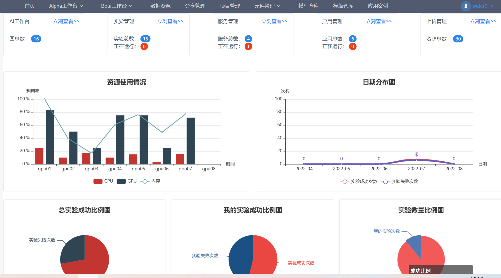

### Alpha工作台——算子管理
用户可以通过步骤上传和打包上传两种方式，上传代码文件作为平台的**算子**供后续使用。
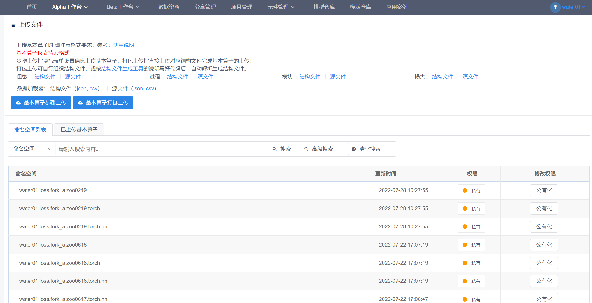
步骤上传算子过程
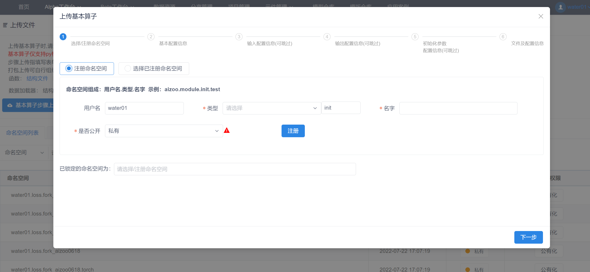

### Alpha工作台——模型管理
实验图列表
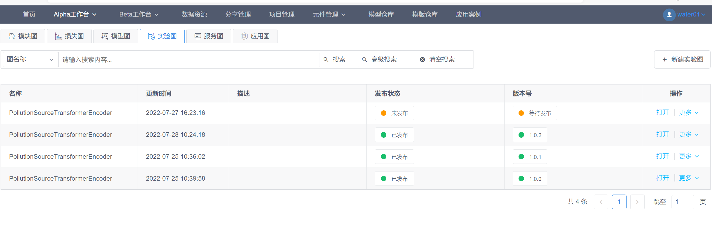
实验图设计展示
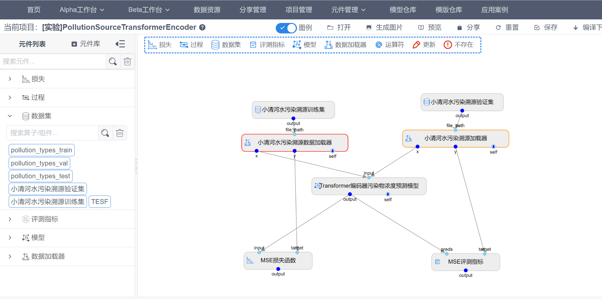
执行实验展示：可以设定实验运行参数，指定想要申请的服务器计算资源
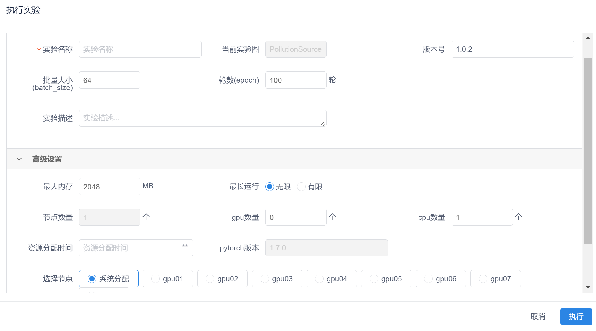

### Alpha工作台——实验管理
实验管理列表
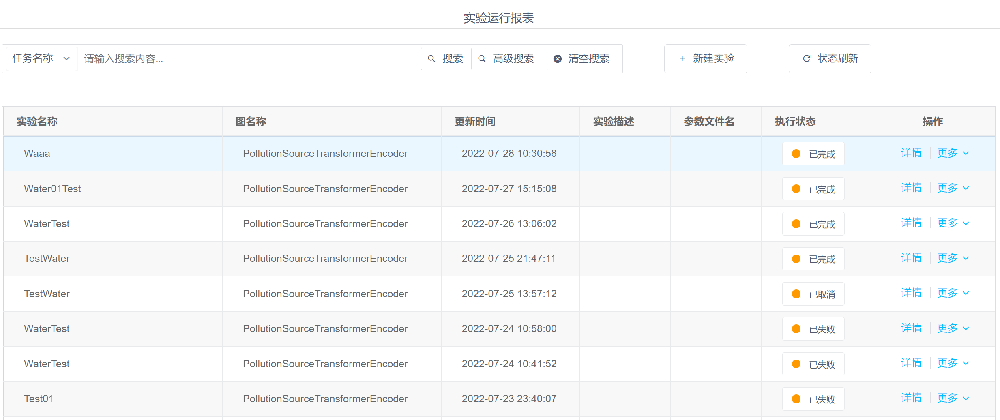
实验任务运行页面：可以实时查看任务运行效果和输出日志
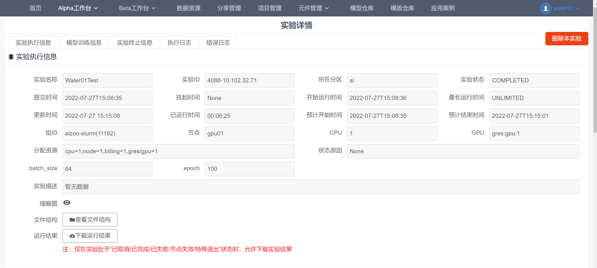
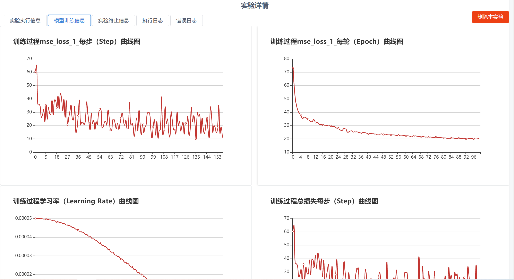
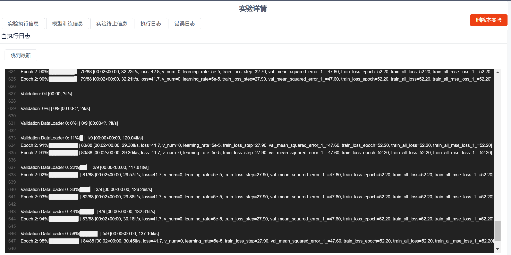

### Alpha工作台——分享管理
用户间可以彼此分享私有的算子资源
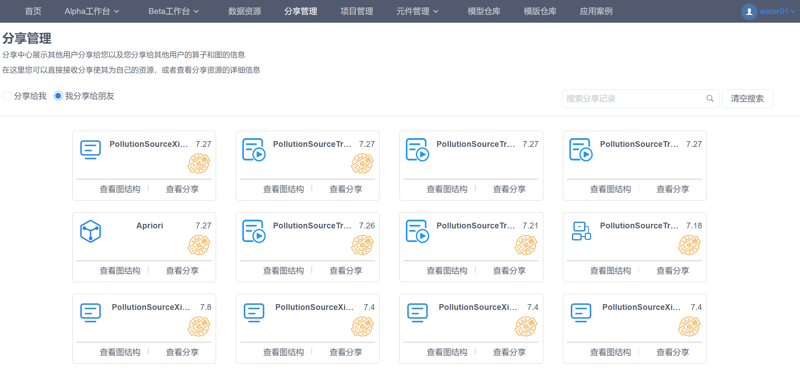

### 元件管理
用户可以通过元件库加载一些常用的算子元件，不需要手动上传
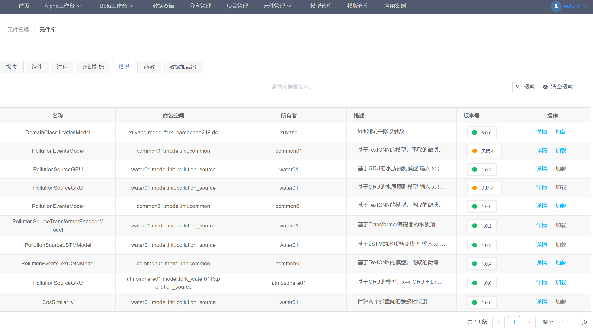

### 模型仓库
介绍一些常用的机器学习、深度学习模型，供用户加载使用
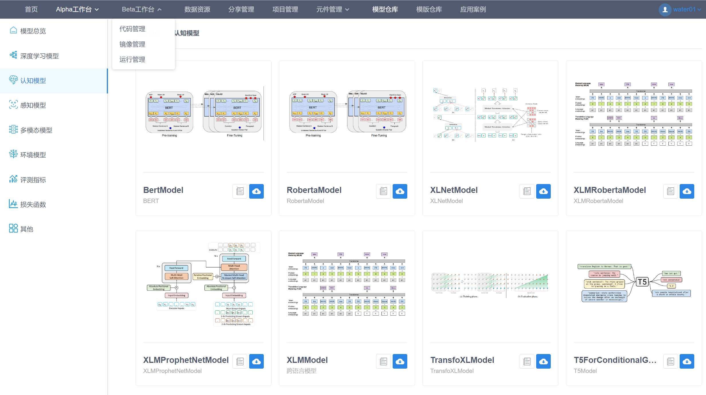

### 其它功能
除了上面的主要模块，还有一些常用的功能，包括代码编译下载、文件管理、notebook代码编辑等
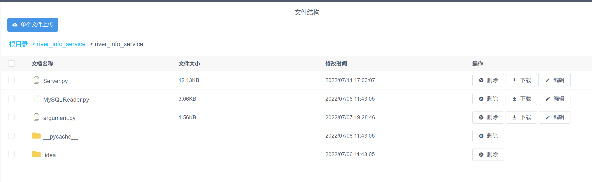
